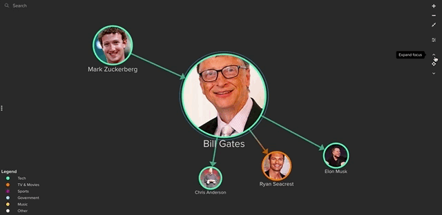

# Focus

Kumu's **focus** feature allows you to focus on one or more elements, connections, and loops, temporarily hiding the rest of the map. It's a great tool for storytelling, allowing you to reduce the complexity of your system or network while you introduce the basic concepts behind your map.

Focus is activated in one of two ways, by clicking and holding on any element, connection or loop or by selecting an element, connection or loop and then clicking the focus icon <i class="fa fa-crosshairs">  </i> on the right side of your map. Once focus is activated, you can walk in and out by degree using the
<i class="fa fa-angle-up">  </i> and <i class="fa fa-angle-down">  </i> buttons.



Click the focus icon again to bring the full map back into view.

<p class="alert alert-info">
<b>Keyboard shortcuts:</b> Press <code>+</code> and <code>-</code> on your keyboard to expand and contract focus, or press a number on your keyboard to specify exactly how many degrees the focus should extend. Press <code>esc</code> on your keyboard to bring the full map back into view.
</p>

## Activate focus in the Advanced Editor

You can pre-define a focus within `@settings` in the [Advanced Editor](/overview/view-editors.html#advanced-editor) of any view.

```
@settings {
  focus: #jack out 2;
}
```

The above will load the map with Jack and any other elements that are within 2 degrees. You can add multiple hubs by using a comma to separate them:

```
@settings {
  focus: #jack out 2, #companyxyz out 1;
}
```

This will load the map with Jack and any other elements that are within 2 degrees, as well as Company XYZ and any elements that are directly connected.

You can use any [selector](/guides/selector-reference.md) to set the focus of the map. For example, you could set the focus to show only influential people, out 2 degrees:

```
@settings {
  focus: person["level of influence"="High"] out 2;
}
```

### Prompted mode

Prompted mode builds on the preset focus by allowing users to build a map based on search criteria. When you've enabled prompted mode, users are presented with a search prompt rather than seeing the full map. Users can then type the name of any element and hit enter to add them to the list of elements to be included in the map. By default that element and its direct connections will be included, but you can tweak the "out 1" setting to also include second and third degree connections.


Click build map and voila! You can also use "out n" for a search to automatically change the number of degrees out included in the search results. For example, "Bill Gates out 3" will display Bill Gates and all elements within 3 degrees.


Hit escape on your keyboard to start over, or use the focus menu and choose "back to prompt" to edit the current map.


To enable prompted mode, you'll need to add the following to the advanced tab of any view you'd like it active within:

```
@settings {
  focus: prompt;
}
```

<span class="edit-link"><a href="https://github.com/kumu/docs/blob/master/guides/focus.md" target="_blank"><i class="fa fa-github"></i> edit this page</a></span>
